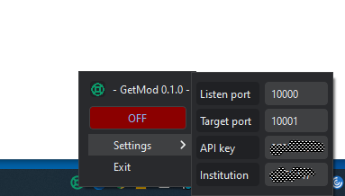

# getmod
Tool for translating old style Alamut Visual http GET requests for Alamut Visual Plus



The tool sits in the windows tray and is accessed using a right click.

Set listen and target ports as well as apikey and institution, and you should be good to go. (Hopefully ..) Start and stop the server using the button in the menu.

Ui made using PySide6 and request translation done using flask. Packed into a one-file executable using nuitka 0.6.19.1, found under releases.


```console
(venv)> python -m nuitka --onefile --enable-plugin=pyside6 --windows-disable-console --windows-icon-from-ico=icons\life-buoy.ico getmod.py
```

### Comments
Exe size is somewhat bloated (26 Mb) due to the use of PySide6.

Had problems using http.server available in the standard Python library, hence the use of flask. 